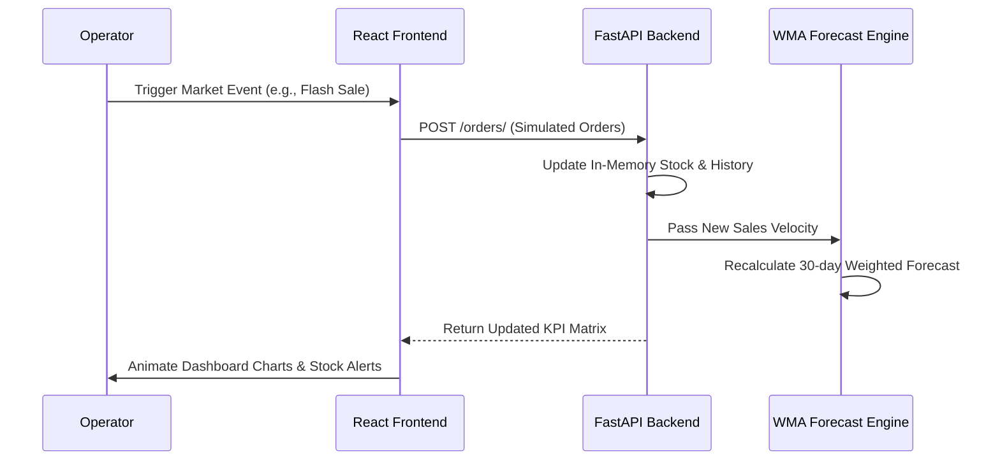

# 🚀 NexusMarket-AI: The Strategic Marketplace Intelligence Center

<div align="center">
  
  
  
  
</div>

<br/>

> [!IMPORTANT]
> **NexusMarket-AI** is not just a storefront; it is a **High-Fidelity Business Simulation Engine**. It bridges the gap between traditional e-commerce and predictive operations, allowing enterprise leaders to stress-test their supply chains against global volatility.

---

## 🏢 **The Core Execution Matrix**

Our development team has engineered this platform as a collaborative intelligence layer.

````carousel
### 🏗️ **Mahesh: Intelligence & Logistics Architect**

**Focus**: Market Stability & Simulation Logic
- **Logistics Core**: Architected the "Mahesh Logistics AI" vendor network for high-durability supply lines.
- **Volatility Engine**: Implemented the "Supply Chain Shock" logic to simulate factory lockdowns and shipping delays.
- **Reporting Layer**: Designed the enterprise-grade CSV export system for rapid operational auditing.
- **System Sync**: Orchestrated the real-time heartbeat between backend state changes and frontend KPI reflows.

<!-- slide -->

### 📊 **Rahul: Data Science & Tech Catalog**

**Focus**: Predictive Modeling & Catalog Optimization
- **The Forecaster**: Built the custom **Weighted Moving Average (WMA)** engine that powers the 30-day outlook charts.
- **Velocity Tracking**: Implemented the granular interaction tracking that determines the "heat" of each product category.
- **Hardware Portfolio**: Curated the "RahulCorp AI" high-performance catalog (Pro Monitors, 4K Webcams).
- **Endpoint Tuning**: Optimized FastAPI routing to ensure sub-100ms response times for AI analytics retrieval.

<!-- slide -->

### 🎨 **Gourav: UI Architect & Wellness Lead**

**Focus**: Interaction Design & User Onboarding
- **Visual Identity**: Crafted the premium **Glassmorphic UI** using a custom vibrant dark-mode design system.
- **The Control Center**: Designed the "Market Event" dashboard, allowing one-click simulation of global externalities.
- **Wellness Sector**: Curated the "GouravTech AI" Wellness & Ergonomics portfolio (Ergonomic Chairs, Standing Desks).
- **Onboarding HUD**: Developed the interactive "Quick Start" guide built directly into the Dashboard's hero section.
````

---

## 🧠 **Proprietary Simulation Intelligence**

NexusMarket-AI operates on a **Closed-Loop Feedback System**. Every user interaction propagates through the entire stack to update the predictive model.

### **1. The Interaction Flow**


### **2. Weighted Moving Average (WMA) Logic**
Traditional forecasting looks at flat averages. **NexusMarket-AI** uses a recency-biased model:
- **T-0 (Latest)**: 50% Weight
- **T-1 (Previous)**: 30% Weight
- **T-2 (Historical)**: 20% Weight

This ensures that a **Flash Sale** triggered today immediately influences the demand forecast for next month, as seen in the interactive charts.

---

## ⚡ **Market Volatility Scenarios**

The platform allows you to simulate high-pressure business environments:

| Scenario | Logic Trigger | Business Impact | KPI Visual Signal |
| :--- | :--- | :--- | :--- |
| **Flash Sale** | demand_velocity * 5 | High Revenue, Rapid Depletion | Revenue Spike 🚀 |
| **Supply Shock** | lead_time + 15 days | Inventory Stagnation, Factory Delay | Stock Alerts ⚠️ |
| **Vibe Check** | vendor_reliability = random() | Partner Performance Volatility | Vendor Score Cards ✨ |

---

## 🛠️ **The Technical Stack**

NexusMarket-AI is built for performance and modularity:

- **Frontend**: **React 18** + **Vite** for blazing fast HMR and a seamless development experience.
- **Data Viz**: **Chart.js** with custom plugins for glassmorphic gradients and responsive reflows.
- **Backend**: **FastAPI** utilizing Pydantic for high-performance data validation.
- **Intelligence**: Custom **Python Analytics Library** for time-series forecasting without the overhead of heavy ML frameworks.
- **Icons**: **React Icons** (Fa, Md) for a consistent, professional design language.

---

## 🚀 **Deployment Instructions**

### **Step 1: The Intelligence Core (Backend)**
```bash
cd backend
python -m venv venv
# Activate the environment
# Windows: .\venv\Scripts\activate
# Unix: source venv/bin/activate
pip install -r requirements.txt
uvicorn app.main:app --reload
```

### **Step 2: The Command Center (Frontend)**
```bash
cd frontend
npm install
npm run dev
```

---

## � **Version History & Changelog**

- **v2.3**: Personalized Team Personas (Rahul, Mahesh, Gourav), Direct Order Simulation, CSV Export Support.
- **v2.2**: High-Fidelity Categories (Wellness, Smart Home), Market Control Center UI.
- **v2.1**: WMA Forecast Engine integration, automated stock-out risk assessment.
- **v2.0**: Initial UI Revamp: Transition to Glassmorphism and Dark Aura theme.

---

<div align="center">
  <h3><b>NexusMarket-AI</b></h3>
  <p>Engineered for the Leaders of Tomorrow</p>
  <br/>
  <p><b>Core Team: Mahesh | Rahul Rathod | Gourav</b></p>
</div>
